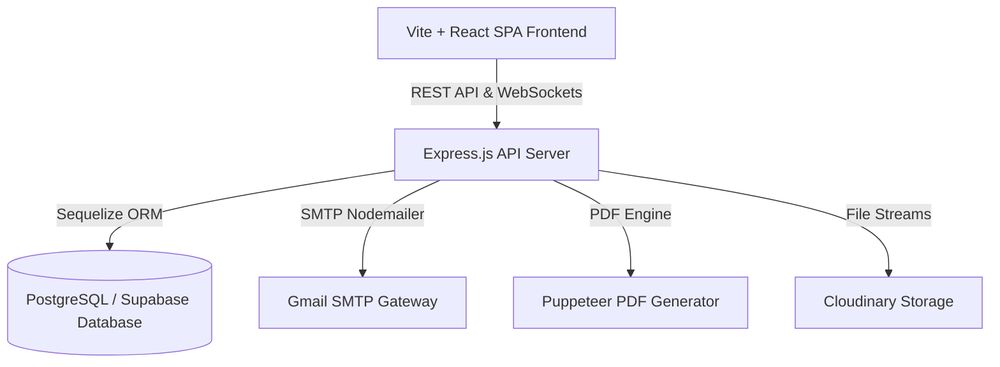
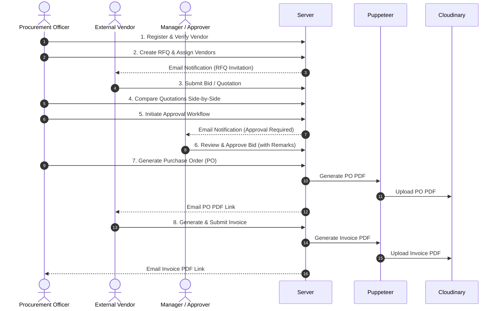

# 🚀 VendorBridge ERP: Procurement & Vendor Management System

[](https://github.com)
[](https://github.com)
[](https://github.com)

**VendorBridge** (formerly VyaparSetu) is a next-generation, high-performance Procurement & Vendor Management Enterprise Resource Planning (ERP) platform. Designed for modern organizations, it replaces fragmented email threads, manual spreadsheets, and un-audited procurement workflows with a centralized, role-based automation suite.

With a highly secure clean-architecture backend and a beautiful glassmorphic dark/light interactive dashboard frontend, VendorBridge manages the entire procurement lifecycle—from registering verified suppliers to sending digital RFQs, comparing bids side-by-side, enforcing approval pipelines, generating official Purchase Orders (POs) and Tax Invoices, and sending them directly via SMTP email.

---

## 🏗 System Architecture & Workflow

VendorBridge is built using the **PERN Stack** (PostgreSQL, Express.js, React, Node.js) with Sequelize ORM for transactional consistency, Socket.io for live notifications, Puppeteer for PDF document generation, and Cloudinary for secure file storage.

### 🌐 System Architecture Diagram


### ⚡ End-to-End Procurement Lifecycle Flow


---

## 🔑 User Roles & Permissions Matrix

The platform implements strict **Role-Based Access Control (RBAC)** to ensure data security and separation of duties.

| Capability | Admin (`ADMIN`) | Procurement Officer (`PROCUREMENT_OFFICER`) | Manager / Approver (`MANAGER`) | External Vendor (`VENDOR`) |
| :--- | :---: | :---: | :---: | :---: |
| **Manage Users & RBAC** | ✅ | ❌ | ❌ | ❌ |
| **Register & Verify Vendors**| ✅ | ✅ | ❌ | ❌ |
| **Draft & Publish RFQs** | ✅ | ✅ | ❌ | ❌ |
| **Submit RFQ Quotations** | ❌ | ❌ | ❌ | ✅ |
| **Compare Quotations** | ✅ | ✅ | ❌ | ❌ |
| **Initiate Approval Pipeline**| ✅ | ✅ | ❌ | ❌ |
| **Approve / Reject Workflow**| ✅ | ✅ | ✅ | ❌ |
| **Generate Purchase Orders** | ✅ | ✅ | ❌ | ❌ |
| **Generate Tax Invoices** | ✅ | ❌ | ❌ | ✅ |
| **View System Audit Logs** | ✅ | ❌ | ❌ | ❌ |

---

## 📂 Project Structure & Component Layout

### Backend Component Layout (`backend`)
* [app.js](file:///c:/Users/Harshit%20kumar/OneDrive/Desktop/Hackathon/VyaparSetu/backend/src/app.js) - Main Express application configuration, middleware injection (CORS, Rate Limit, Helmet, Body parser).
* [server.js](file:///c:/Users/Harshit%20kumar/OneDrive/Desktop/Hackathon/VyaparSetu/backend/src/server.js) - Entry point. Connects to PostgreSQL via Sequelize, runs migrations, initializes Socket.io, and boots the HTTP server.
* **src/config/** - Configuration parameters for database connections and third-party APIs:
  - [database.js](file:///c:/Users/Harshit%20kumar/OneDrive/Desktop/Hackathon/VyaparSetu/backend/src/config/database.js) - Dev, test, and production database setups with SSL support.
  - [cloudinary.js](file:///c:/Users/Harshit%20kumar/OneDrive/Desktop/Hackathon/VyaparSetu/backend/src/config/cloudinary.js) - Cloudinary storage and Multer image-parsing setups.
* **src/models/** - Sequelize schemas representing DB relations and associations:
  - [user.js](file:///c:/Users/Harshit%20kumar/OneDrive/Desktop/Hackathon/VyaparSetu/backend/src/models/user.js) & [role.js](file:///c:/Users/Harshit%20kumar/OneDrive/Desktop/Hackathon/VyaparSetu/backend/src/models/role.js) - User credentials, hashed passwords, and roles mapping.
  - [vendor.js](file:///c:/Users/Harshit%20kumar/OneDrive/Desktop/Hackathon/VyaparSetu/backend/src/models/vendor.js) & [vendorCategory.js](file:///c:/Users/Harshit%20kumar/OneDrive/Desktop/Hackathon/VyaparSetu/backend/src/models/vendorCategory.js) & [vendorUser.js](file:///c:/Users/Harshit%20kumar/OneDrive/Desktop/Hackathon/VyaparSetu/backend/src/models/vendorUser.js) - Supplier database.
  - [rfq.js](file:///c:/Users/Harshit%20kumar/OneDrive/Desktop/Hackathon/VyaparSetu/backend/src/models/rfq.js) & [rfqItem.js](file:///c:/Users/Harshit%20kumar/OneDrive/Desktop/Hackathon/VyaparSetu/backend/src/models/rfqItem.js) & [rfqVendor.js](file:///c:/Users/Harshit%20kumar/OneDrive/Desktop/Hackathon/VyaparSetu/backend/src/models/rfqVendor.js) - RFQ documents, multi-item line details, and assigned vendors.
  - [quotation.js](file:///c:/Users/Harshit%20kumar/OneDrive/Desktop/Hackathon/VyaparSetu/backend/src/models/quotation.js) & [quotationItem.js](file:///c:/Users/Harshit%20kumar/OneDrive/Desktop/Hackathon/VyaparSetu/backend/src/models/quotationItem.js) - Submitted vendor pricing and delivery timelines.
  - [approvalWorkflow.js](file:///c:/Users/Harshit%20kumar/OneDrive/Desktop/Hackathon/VyaparSetu/backend/src/models/approvalWorkflow.js) & [approvalStep.js](file:///c:/Users/Harshit%20kumar/OneDrive/Desktop/Hackathon/VyaparSetu/backend/src/models/approvalStep.js) - Approval workflows and ordered approver actions.
  - [purchaseOrder.js](file:///c:/Users/Harshit%20kumar/OneDrive/Desktop/Hackathon/VyaparSetu/backend/src/models/purchaseOrder.js) - Approved purchase records and reference IDs.
  - [invoice.js](file:///c:/Users/Harshit%20kumar/OneDrive/Desktop/Hackathon/VyaparSetu/backend/src/models/invoice.js) - Billing documents with subtotal, tax calculations, and PDF links.
* **src/controllers/** - Route handlers routing incoming API payloads to services.
* **src/services/** - Core business logic layer:
  - [pdf.service.js](file:///c:/Users/Harshit%20kumar/OneDrive/Desktop/Hackathon/VyaparSetu/backend/src/services/pdf.service.js) - HTML to PDF generation using Puppeteer and Cloudinary uploading.
  - [email.service.js](file:///c:/Users/Harshit%20kumar/OneDrive/Desktop/Hackathon/VyaparSetu/backend/src/services/email.service.js) - Automated mail dispatches.
  - [approval.service.js](file:///c:/Users/Harshit%20kumar/OneDrive/Desktop/Hackathon/VyaparSetu/backend/src/services/approval.service.js) - Approval workflow routing and remarks capture.
* **src/routes/** - Express router endpoint mounts.
* **src/middlewares/** - Global guards (RBAC verification, authentication checks, validation catches).

### Frontend Component Layout (`frontend`)
* [main.jsx](file:///c:/Users/Harshit%20kumar/OneDrive/Desktop/Hackathon/VyaparSetu/frontend/src/main.jsx) & [App.jsx](file:///c:/Users/Harshit%20kumar/OneDrive/Desktop/Hackathon/VyaparSetu/frontend/src/App.jsx) - Main entry point and global layout wrapper with support for dynamic Dark/Light Mode.
* [LandingPage.jsx](file:///c:/Users/Harshit%20kumar/OneDrive/Desktop/Hackathon/VyaparSetu/frontend/src/pages/LandingPage.jsx) - Interactive homepage showcasing a mock Quotation Comparison Matrix, a live multi-role workflow pipeline preview, a system statistics tracker, and active audit history blocks.
* **src/styles/** - Glassmorphism and tailored dark/light theme definitions.

---

## 🗄️ Database Schema & Models Reference

All tables are modeled using Sequelize with relational integrity constraints:

```
+---------------+      +--------------+      +------------------+
|     roles     |----->|    users     |----->|  approval_steps  |
+---------------+      +--------------+      +------------------+
                              |                       ^
                              v                       |
+----------------------+      +------------------+    |
|   vendor_categories  |<-----|  vendor_users    |    |
+----------------------+      +------------------+    |
         ^                            |               |
         |                            v               |
         +---------------------|   vendors   |        |
                               +-------------+        |
                                      |               |
                                      v               |
+---------------+      +--------------+               |
|  rfq_vendors  |<-----|    rfqs      |               |
+---------------+      +--------------+               |
                              |                       |
                              v                       |
                       +--------------+               |
                       |  rfq_items   |               |
                       +--------------+               |
                              |                       |
                              v                       |
+---------------+      +--------------+               |
| quotation_it. |<-----|  quotations  |<--------------+
+---------------+      +--------------+
                              |
                              v
                       +--------------+      +--------------+
                       | purch_orders |----->|   invoices   |
                       +--------------+      +--------------+
```

---

## 🔌 API Route Prefixes

All API routes are protected by JWT token authentication (excluding public authentication paths). The system exposes the following core route prefixes:

- **Authentication** (`/api/auth`): Registration, login, logout, session management, and password recovery.
- **Vendors** (`/api/vendors`): Supplier registration, category tagging, status updates, and detail lookup.
- **RFQs** (`/api/rfqs`): Drafting, publishing, files upload, and vendor assignment.
- **Quotations** (`/api/quotations`): Quotation submission, detailed lookup, and RFQ-specific bid aggregation.
- **Approvals** (`/api/approvals`): Workflow initiation, approval step authorizations, and remark entries.
- **Purchase Orders** (`/api/pos`): Conversion of approved quotations to official PO documents.
- **Invoices** (`/api/invoices`): Billing records, automated tax calculations, and PDF invoice generators.
- **Notifications** (`/api/notifications`): Retrieve real-time updates and notifications.

---

## 🛠️ Environment Configuration & Setup

### Prerequisites
1. **Node.js** (v18 or higher recommended)
2. **PostgreSQL** instance (local database or hosted Supabase service)
3. **Cloudinary Account** (for file attachments and PDF uploads)
4. **SMTP Email Account** (Gmail App password recommended for mail dispatches)

### 🔐 Environment Variables Configuration

Create a `.env` file in the `backend` directory:
```env
PORT=5000
NODE_ENV=development

# PostgreSQL connection string
DATABASE_URL=postgresql://<username>:<password>@<host>:<port>/<dbname>

# JWT Authentication secrets
JWT_SECRET=your_jwt_signing_secret_here
JWT_REFRESH_SECRET=your_jwt_refresh_signing_secret_here
JWT_EXPIRES_IN=1h
JWT_REFRESH_EXPIRES_IN=7d

# Cloudinary assets storage config
CLOUDINARY_CLOUD_NAME=your_cloudinary_cloud_name
CLOUDINARY_API_KEY=your_cloudinary_api_key
CLOUDINARY_API_SECRET=your_cloudinary_api_secret

# SMTP Mail configurations
SMTP_HOST=smtp.gmail.com
SMTP_PORT=465
SMTP_USER=your_email@gmail.com
SMTP_PASS=your_gmail_app_password
```

Create a `.env` file in the `frontend` directory:
```env
VITE_API_URL=http://localhost:5000/api
```

---

## 🚀 Installation & Run Steps

### 1. Backend Setup
```bash
# Navigate to the backend workspace
cd backend

# Install dependencies (use legacy-peer-deps if peer resolution mismatches occur)
npm install --legacy-peer-deps

# Create / seed the database
# Models automatically sync on startup. To seed the essential roles:
npx sequelize-cli db:seed:all

# Start the server in development mode (runs nodemon)
npm run dev
```

### 2. Frontend Setup
```bash
# Navigate to the frontend workspace
cd ../frontend

# Install dependencies
npm install

# Start Vite server
npm run dev
```

### 3. Database Cleaning Helper
During development, if you need to wipe and reset the database structure, run:
```bash
node clear-db.js
```

---

## 🧪 Integration Verification Testing

A comprehensive E2E test file is provided in [integration-test.js](file:///c:/Users/Harshit%20kumar/OneDrive/Desktop/Hackathon/VyaparSetu/backend/integration-test.js) to assert the entire business logic flow in one command:

1. **Launches authentication checks** & grabs JWT cookies.
2. **Creates a new vendor**.
3. **Drafts an RFQ** with line items and deadlines, and assigns the vendor.
4. **Registers a vendor user** and submits a bid with pricing.
5. **Initiates approval workflow** and approves it with a manager remark.
6. **Generates the Purchase Order** (triggering Cloudinary PDF uploads).
7. **Compiles the Tax Invoice** from the PO.

### Running the E2E verification test:
Ensure the backend server is running on port `5001` (or update `BASE_URL` in `integration-test.js`), then run:
```bash
cd backend
node integration-test.js
```

Upon success, you should see:
```text
--- Phase 1: Auth ---
✅ Login Successful

--- Phase 2: Vendor ---
✅ Vendor Created: a1b2c3d4-...

--- Phase 3: RFQ ---
✅ RFQ Created: b2c3d4e5-...

--- Phase 4: Quotation ---
✅ Quotation Submitted: c3d4e5f6-...

--- Phase 5: Approval ---
✅ Approval Workflow Initiated: d4e5f6g7-...
✅ Quotation Approved (Workflow Step 1)

--- Phase 6: Purchase Order ---
✅ PO Generated: e5f6g7h8-...

--- Phase 7: Invoice ---
✅ Invoice Generated: f6g7h8i9-...

--- TEST COMPLETE: SUCCESS ---
```
